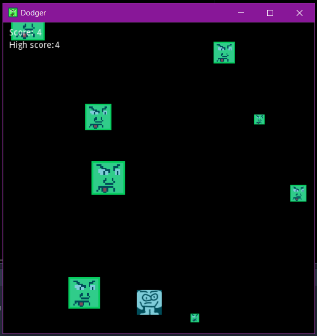
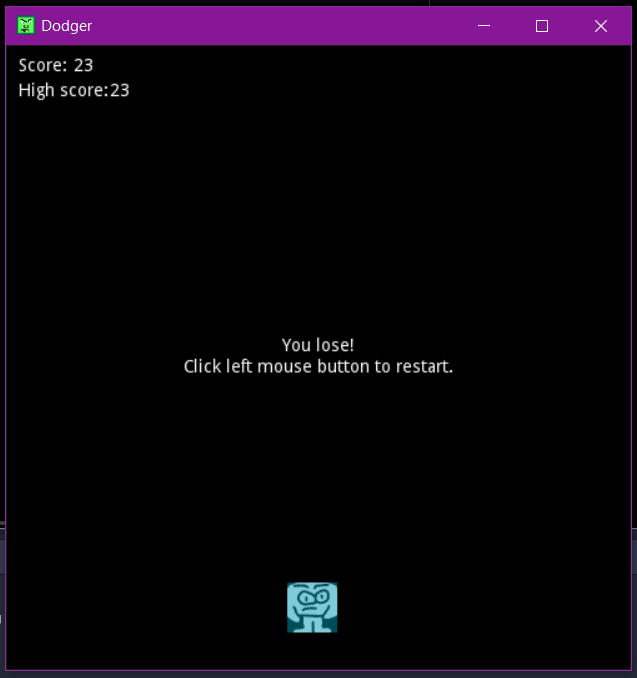

# Dodger

It's the first game of the list games to practice how to implement games with Godot engine.

Godot version: 3.2.1

## Description of the game

Several bad guys fall from the top of the screen, and the user must avoid them. The player can be controlled with the arrow keys or more directly with the mouse. The longer the player lasts without being hit, the higher the score.

## Screenshot

## References

https://inventwithpython.com/blog/2012/02/20/i-need-practice-programming-49-ideas-for-game-clones-to-code/
