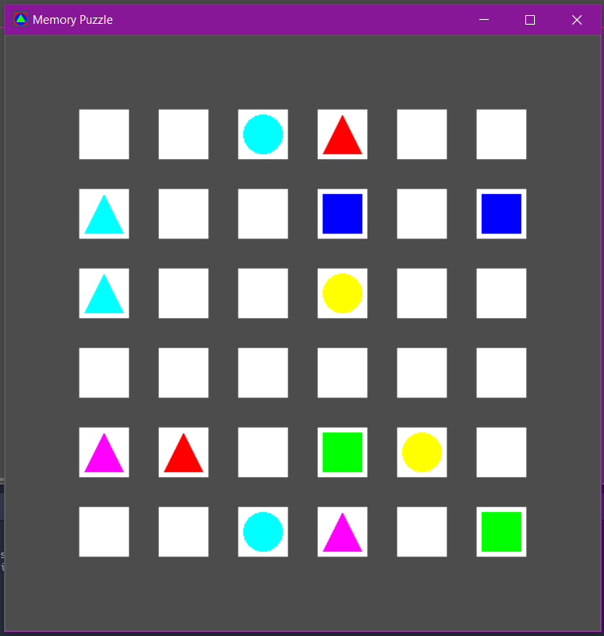
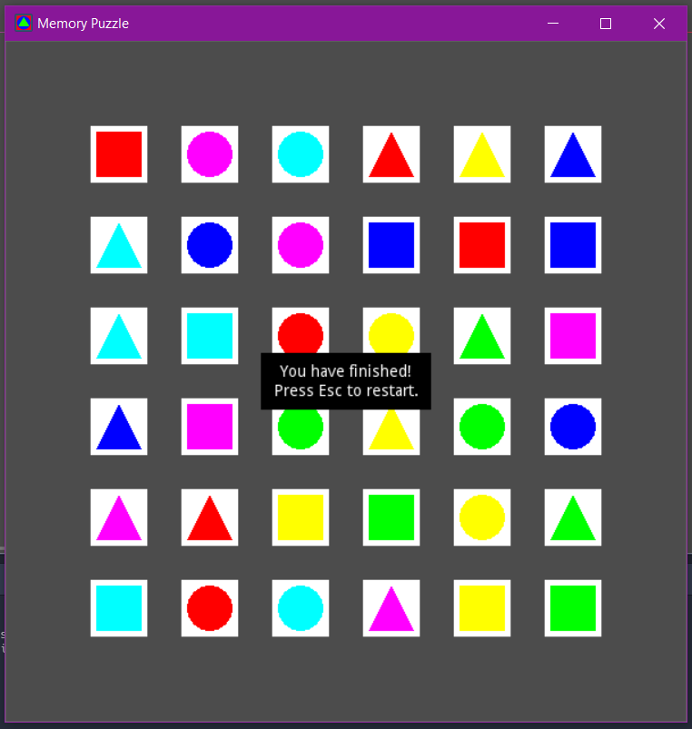

# Memory Puzzle

It's the second game of the list games to practice how to implement games with Godot engine.

Godot version: 3.2.1

## Description of the game

A board full of overturned cards. There is a pair for each card. The player flips over two cards. If they match, then they stay overturned. Otherwise they flip back. The player needs to overturn all the cards in the fewest moves to win.

## Screenshots

## References

https://inventwithpython.com/blog/2012/02/20/i-need-practice-programming-49-ideas-for-game-clones-to-code/
